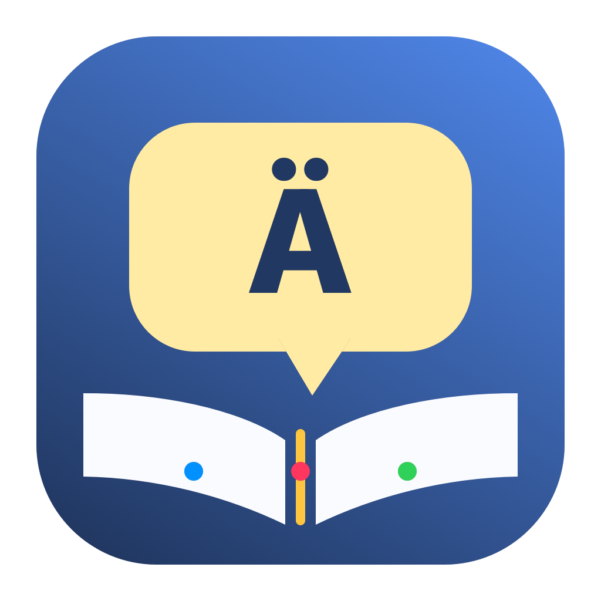
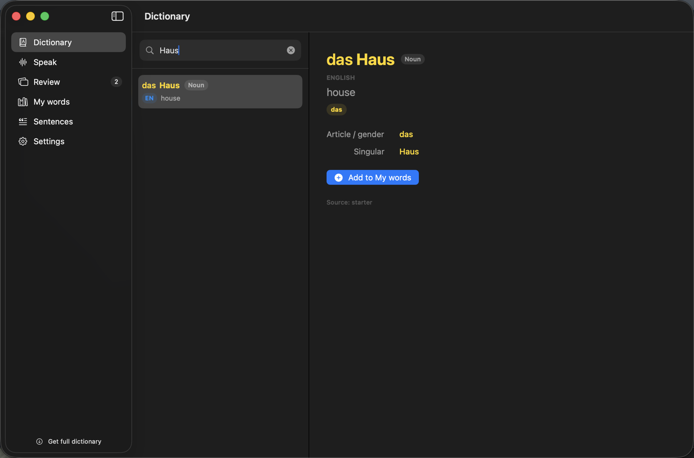
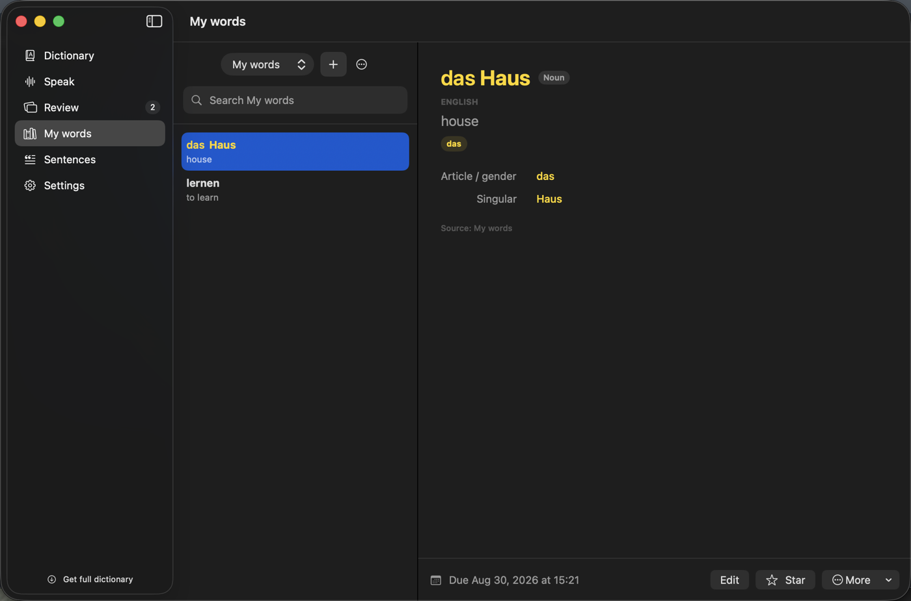
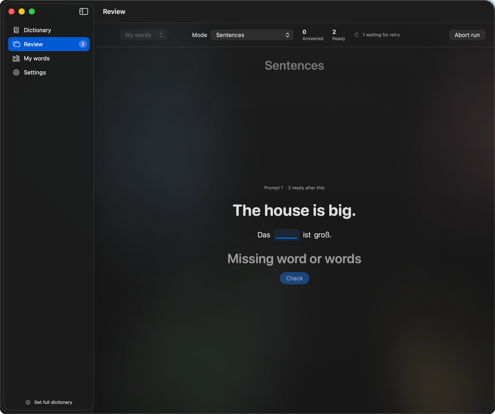

<p align="center">
  
</p>

<h1 align="center">Lang4Self</h1>

<p align="center">A keyboard-first, fully local German-learning app for macOS 14+.</p>

<p align="center">
  <a href="https://github.com/Mr3zee/lang4self/actions/workflows/ci.yml"></a>
  <a href="LICENSE"></a>
</p>

Lang4Self combines a fast offline dictionary, speech lookup, spaced-repetition review, word lists, and locally generated example sentences. There is no account, telemetry, or cloud backend.

## Screenshots

| Dictionary | My words |
|---|---|
|  |  |



The screenshots use the app's small deterministic test fixture. They do not contain imported dict.cc or personal data.

## Features

- Fast SQLite + FTS5 lookup across more than one million imported entries
- English and Russian translations from user-supplied dict.cc exports
- Optional offline Wiktionary explanations
- On-device German Apple Speech lookup in Dictionary
- Named word lists and SM-2-style review scheduling
- Local example-sentence generation through LM Studio
- Keyboard navigation throughout the app
- A shared `Lang4SelfCore` library and a small command-line client

## Run locally

Requirements: macOS 14 or newer, Xcode 15.3 or newer, and the Xcode command-line tools.

```sh
git clone https://github.com/Mr3zee/lang4self.git
cd lang4self
open Lang4Self.xcodeproj
```

In Xcode, select the **Lang4Self** scheme and **My Mac**, then press **⌘R**. The first launch creates a local database and adds a tiny original starter dictionary; no separate download is required to try the app.

### Get the full dictionary data

dict.cc does not permit its translation data to be redistributed with this repository. Each user must download their own copy:

1. Open the official [dict.cc translation file request](https://www1.dict.cc/translation_file_request.php?l=e).
2. Accept the terms and request the `DE → EN`, `DE → RU`, or both UTF-8 exports.
3. Download the ZIP or text file from the email sent by dict.cc.
4. In Lang4Self, open **Settings → Offline dictionary → Import Dictionary** and choose the downloaded file. ZIP files can be selected directly.

Keep downloaded exports outside this checkout. Common dict.cc filenames, archives, and SQLite databases are ignored as an extra safeguard, and CI rejects local data files if they become tracked.

For richer German definitions and verified noun, verb, and adjective forms, optionally download Lector's [free German SQLite dictionary](https://lector.dev/free/german-dictionary/). Import the `.db` file using **Settings → Offline dictionary → Import Lector database**. The data remains on your Mac; generated grammar rules are used only when imported forms are unavailable.

### Enable local sentence generation

1. Install [LM Studio](https://lmstudio.ai/) and a text-generation model.
2. Install the [`lms` command-line tool](https://lmstudio.ai/docs/developer/core/lms-cli) from LM Studio.
3. Choose the model and generation settings in Lang4Self's **Settings**.

Lang4Self starts the localhost server and loads the selected model on first use. It offloads its model instance when the app quits.

## Tests and builds

Run the core tests and repository checks:

```sh
swift test
./scripts/check-public-data.sh
./scripts/check.sh
```

Run the macOS UI tests:

```sh
xcodebuild -quiet -project Lang4Self.xcodeproj -scheme Lang4Self \
  -destination 'platform=macOS,arch=arm64' \
  -only-testing:Lang4SelfUITests test
```

GitHub Actions runs both the core and complete macOS UI suites on every push to `main` and every pull request targeting `main`.

Build the app bundle or install a local release:

```sh
./scripts/build-macos.sh
./scripts/build-release.sh
./scripts/release.sh
```

The release script installs `Lang4Self.app` in `~/Applications`, refreshes its Spotlight and Launch Services metadata, and installs the CLI in `~/.local/bin`. If Raycast is running, the script restarts it in the background so its application icon cache is refreshed. `./scripts/install.sh` is an alias for the same command.

CLI examples:

```sh
lang4self                 # open the app
lang4self Haus            # search the local dictionary
lang4self stats
lang4self import ~/Downloads/dict.zip
lang4self import-explanations ~/Downloads/dictionary-de.db
```

## Keyboard controls

| Keys | Action |
|---|---|
| ⌘1 … ⌘5 | Open Dictionary, Review, My words, Sentences, or Settings |
| ⌘F | Focus Dictionary or My words search |
| ⌘? | Show all shortcuts |
| ↑ / ↓ | Navigate results, saved cards, and sentences |
| Return | Open or confirm the current selection |
| ⌘Return | Add the selected dictionary entry |
| Hold Space | Outside text fields, record speech; release to look it up |
| Space | Reveal a review |
| 1 … 4 | Rate a review: Again, Hard, Good, or Easy |
| Delete | Remove the selected saved card or sentence |
| Esc | Clear search, leave inspection, or close a dialog |

## Data and licensing

Code in this repository is licensed under [GPL-2.0-or-later](LICENSE).

dict.cc translation data is not open-source data. Personal use is allowed under the separate dict.cc terms, but the exports are never bundled or republished here. Imported explanations originate from Wiktionary via kaikki.org and Lector and are licensed under CC BY-SA 4.0; they also remain local and are not bundled.
